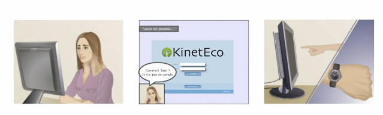
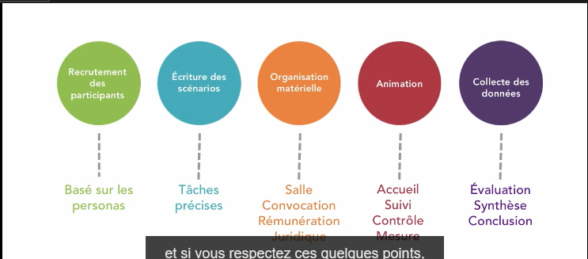
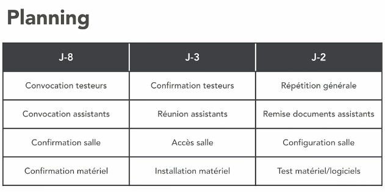
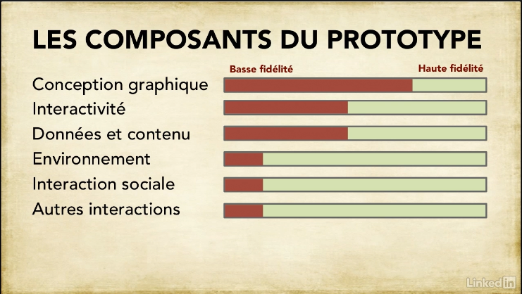
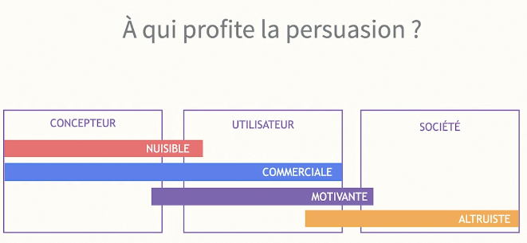
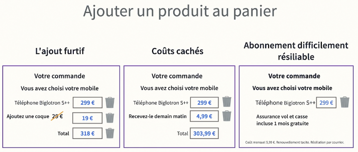
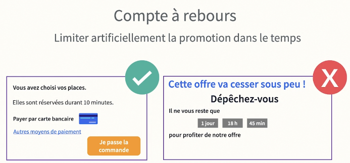
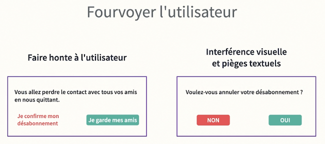
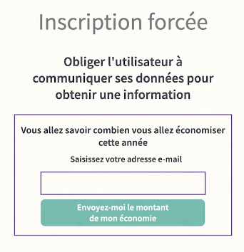
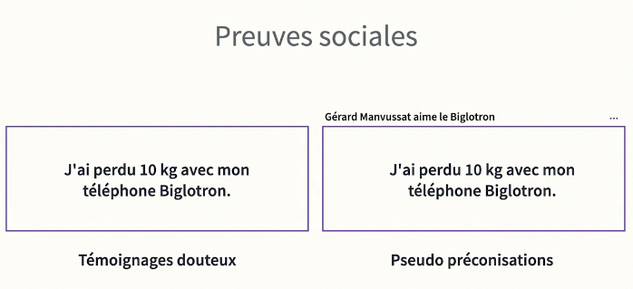

<h1 align="center">Autoformation UX</h1>

- [Qu'est ce que l'UX ?](#quest-ce-que-lux-)
  - [Problèmes logiques](#problèmes-logiques)
  - [Logique pure](#logique-pure)
  - [Solutions](#solutions)
  - [Processus](#processus)
  - [Conlusion](#conlusion)
- [Conception Centré Utilisateur (CCU)](#conception-centré-utilisateur-ccu)
- [Termes importants](#termes-importants)
  - [Cocréation](#cocréation)
  - [Parcours utilisateur](#parcours-utilisateur)
  - [Micromoment](#micromoment)
  - [Points de contact](#points-de-contact)
- [Persona](#persona)
  - [Créer vos personas](#créer-vos-personas)
    - [Socio-démographique](#socio-démographique)
    - [Comportementals](#comportementals)
    - [Problèmes](#problèmes)
    - [Contacts](#contacts)
    - [Collecter la clientèle](#collecter-la-clientèle)
- [Analyse de donnée](#analyse-de-donnée)
  - [Comprendre l'utilisateur](#comprendre-lutilisateur)
  - [Techniques d'observation](#techniques-dobservation)
  - [Métriques](#métriques)
  - [Outils](#outils)
- [La conceptualisation créative](#la-conceptualisation-créative)
  - [Design charette](#design-charette)
- [Scénario et storyboard](#scénario-et-storyboard)
  - [Storyboard](#storyboard)
    - [Création](#création)
- [Tests](#tests)
  - [Que tester ?](#que-tester-)
  - [Taux de mesure:](#taux-de-mesure)
  - [Quand tester ?](#quand-tester-)
  - [Comment tester ?](#comment-tester-)
  - [Recruter les participants](#recruter-les-participants)
  - [Planification](#planification)
  - [Questionnaire post-test](#questionnaire-post-test)
  - [Qualitatif et quantitaf (Évaluation finale)](#qualitatif-et-quantitaf-évaluation-finale)
- [Prototypes](#prototypes)
  - [Processus](#processus-1)
  - [Comprendre la fidélité](#comprendre-la-fidélité)
  - [Esquisses](#esquisses)
  - [Prototype papier](#prototype-papier)
    - [Atouts](#atouts)
    - [Faiblesses](#faiblesses)
  - [Prototype HTML](#prototype-html)
    - [Atouts](#atouts-1)
    - [Faiblesses](#faiblesses-1)
- [UX pour le design web](#ux-pour-le-design-web)
  - [Designer pour les différentes générations](#designer-pour-les-différentes-générations)
    - [Baby boomers](#baby-boomers)
    - [Génération X](#génération-x)
    - [Milléniaux](#milléniaux)
    - [Génération Z](#génération-z)
    - [Génération Alpha](#génération-alpha)
  - [Guider l'utilisateur](#guider-lutilisateur)
  - [Interactions](#interactions)
  - [Causes de rebond/abandon](#causes-de-rebondabandon)
    - [Insatisfaction](#insatisfaction)
  - [Accessibilité](#accessibilité)
  - [Navigation](#navigation)
    - [Menu](#menu)
  - [Texte à l'écran](#texte-à-lécran)
  - [Formulaires](#formulaires)
- [Cadrer son projet](#cadrer-son-projet)
  - [Feuille de cadrage](#feuille-de-cadrage)
- [Dark patterns](#dark-patterns)

# Qu'est ce que l'UX ?

UX signifie User eXperience. Cela représente la perception et le retour d'une personne sur l'utilisation d'un produit ou service. On peut également inclure le **parcours** et le **ressenti** de **l'utilisateur**.

L'UX change également la façon de créer son produit, **on n'est plus sur une production centré sur le produit mais centré sur l'utilisateur.**  
On applique donc la Conception Centré Utilisateur (CCU).

L'UX se présente sous 3 couches :
- Forme (design)
- Fond (contenu)
- Contexte (structure)

## Problèmes logiques

Ces problèmes proviennent de différents facteurs :
- Liés à l'interaction
- Liens
- Dispositifs
- Absences d'interface

Les mots seuls ne peuvent pas exprimer un message clairement.

## Logique pure

- Propositions
- Universalité
- Arguments
- Opérateurs
  - Logique : AND, OR, NOT
  - Complexe : IF, XOR, = (égal)

## Solutions

- Organisation
  - Arborescence
  - Chronologique
- Causalité
- Logique

## Processus

Boucle :
1. Prototypage
2. Tests
3. Optimisation
4. Nouveaux tests

Phase du projet :
1. Préconception
2. Conception structurelle
3. Parcours utilisateur
4. Design graphique
5. Développement

## Conlusion

La logique humaine repose sur :
- Cadre
- Perspective
- Sens

Tandis que celle des ordinateurs repose sur :
- **Validité**

Voici quelques règles (ou conseils) :
- **Éviter l'ambiguïté**
- **Vous n'êtes pas l'utilisateur cible**
- **Assumez que l'utilisateurne sait rien**
- **Trouver l'essence de votre message**

# Conception Centré Utilisateur (CCU)

Processus de CCU:
1. Ciblage et personas
2. Analyse des données utilisateur
3. Conceptualisation
4. Storyboard
5. Tests

# Termes importants

## Cocréation

Cocréation = concevoir des interfaces avec les utilisateurs

Bénéfices :
- Dispositifs efficaces
- Facilité d'utilisation
- Satisfaction

Processus de création d'interface :
1. Création d'interface
2. Test de l'interface par des utiisateurs (recueil de donnée)
3. Optimisation
4. Test de l'interface par des utiisateurs (recueil de donnée)
5. Optimisation
6. Etc...

## Parcours utilisateur

1. Conscience du produit (penser à résoudre un problème)
   - Curiosité => Sensibilisation
2. Découverte
   - Confustion => Recherche
3. Considération
   - Rationalité => Comparaison
4. Achat
   - Hésitation => Prise de décision
5. Expérience
6. Partage

## Micromoment

C'est un moment où l'utilisateur veut satisfaire son désir
- 37% des sessions sont inférieurs à 1 minute
- 80 % l'ont transformé un moment détente
- Je veux aller
- Je veux savoir
- Je veux faire
- Je veux acheter

Concevoir des interfaces rapides et fluides pour profiter de ces moments.

## Points de contact

- Site web/e-mailing
- Résultats des requêtes
- Cartes de localisation
- Réseaux sociaux
- Signalétique locale
- Renseignements téléphoniques
- Service après-vente

# Persona

Un persona =
- Personnage imaginaire
- Représente la cible ou une partie de la cible
- Identité définie
- Attributs et caractéristiques
- Comportements
- Scénarios

Ils permettent de combler les lacunes des statistiques qui :
- Indiquent :
  - Combien ?
  - Où ?
- Mais n'indiquent pas :
  - Pourquoi ?
  - Comment ?
  - Ce que l'on pense ?

## Créer vos personas

Il est important de noter qu'il faut :
- Prioriser les profils cibles
- **3-4 personas maximum**

Commencer par définir :
- Objectifs de l'utilisation
- Tâches à accomplir
- Contexte d'utilisation
- Niveau de connaissance
- Habilité

Définissez ensuite les informations liés aux prochains chapitres (Socio-démographique, Comportementals, Problèmes, Contacts)

### Socio-démographique

Vie personnelle :
- Âge
- Genre
- Situation familiale
- Habitat

Vie professionnelle :
- Fonction
- Taille entreprise
- Salaire
- Lieu de travail

### Comportementals

Contexte :
- Mode de vie
- Éducation
- Culture
- Modes d'achats

### Problèmes

Comprendre :
- But recherché
- Nature du problème à résoudre
- Points de blocages ou irritants (pain points)
- Objections
- Facteurs de décision

### Contacts

Comprendre :
- Sources d'informations
- Réseaux sociaux
- Programmes télévisés
- Manifestation professionnelle

### Collecter la clientèle

Vous pouvez collecter les données :
- Auprès de la clientèle, exemples :
  - Sondages
  - Formulaire
  - Panels
  - Entretiens sur site
- Auprès des collaborateurs, exemples :
  - Service commercial
  - Service après-vente
  - Service de formation

# Analyse de donnée

## Comprendre l'utilisateur

Les stats indiquent :
- Qui fait quoi
- Qui ne fait pas quoi

Mais n'indiquent pas :
- Pourquoi on le fait
- Comment on le fait
- Ce que l'on ressent en le faisant

Effectuer des phases des tests avec des utilisateurs types et on observe leur comportements

## Techniques d'observation

Observer les actions et le ressenti de l'utilisateur

Requis pour les phase d'observation :
- 3 utilisateurs minimum par person
- 2 observateurs par utilisateur
- Carnets de notes

Durant la phase (regarder et écouter) :
- Ne pas interrompre l'utilisateur
- Incitez les participants à commenter
- N'utilisez pas la vidéo
- Ne prenez pas de notres sur tablettes
- Notez leurs actions
- Notez leur objectifs et raisonnements
- Notez leurs commentaires
- Si l'utilisateur rencontre un problème, on doit comprendre la source

Questionner :
- Questions ouvertes
- Ne suggérez pas
- N'engagez pas une conversation
- Ne demandez pas de trouver une solution
- Notez, notez

Prise de notes (**en priorité**) :
- Description des actions
- Commentaires des utilisateurs
- Temps de réalisation des actions
- Problèmes rencontrés
- Solutions trouvées (ou non)
- Sentiment de facilité

## Métriques

- Adéquation : atteinte du but fixé
- Efficacité : atteinte du but fixé de façon optimale
  - Temps nécessaires
  - Nombre d'étapes nécessaires
  - Nombre d'erreurs
  - Nombre d'abandons

- Satisfaction : facilité perçue
  - Évaluation globale (1 à 10)
  - Nombre de points de frustration
  - Nombre de points positifs

## Outils

UXpressia

Realtime Board

Canvanizer

# La conceptualisation créative

Brainstorming pas forcément la meilleure technique

Méthode du jeu de rôle (Concepteur, développeur, client final, etc...)

## Design charette

- Recueillir les idées inspirantes
- Sortir du syndrome de la page blanche
- Comprendre les priorités des personnes de groupes différents

Déroulement :
- Rassemblez les participants dans une pièce
- Créer des petits groupes basés en fonction de caractéristiques communes
- Distribuez à chacun des feuilles de papier, des notes adhésives et des feutres
- Écrire le but de la session
- Précisez les modalités de l'atelier
  - Chacun dessine ses idées pendant 5 minutes, sans discussion
  - Chacun expose ses idées et motivations en 2 minutes
  - Le groupe peut poser 1 question. La réponse ne peut excéder 1 minute
  - L'animateur collecte les feuilles et enregistre les idées

# Scénario et storyboard

Pour un utilisateur, un chemin :
- Ne mène pas toujours à l'achat
- Peut être sans issue
- Peut être semé d'embuches
- Peut devenir un chemin de croix

L'utilisateur peut :
- Trouver son chemin
- Poursuivre son petit bonhomme de chemin
- Rebrousser chemin
- Passer son chemin

Un scénario précise un processus :
- Concevoir les interactions
- Réaliser les prototypes
- Organiser des sessions de tests
- Guider les designers front-end
- Arbitrer les choix de solutions techniques
- Évaluer et piloter le développement

Points forts :
- Présentation synthétique du parcours
- Explicite des variantes parfois complexes
- Couvre la totalité de l'interaction
- Est évolutif
- Valide la conception

Base du scénario :
- Qui ?
- Pourquoi ?
- Comment ?

## Storyboard

Un storyboard est une présentation visuelle d'un scénario

Points forts :
- Visualisation immédiate
- Annotation et bulles
- Mise en évidence des bifurcations
- Souplesse de mise en oeuvre
- Collaboratif

Le storyboard visualise :
- Propositions d'un groupe
- Interactions complexes
- Pour organiser des sessions de tests
- Pour guider les designers front-end
- Arbitrer les choix de solutions techniques
- Évaluer et piloter le développement

### Création

Cela ressemble à des bandes dessinées dans l'idée

Si l'image n'est pas assez explicite, ajoutez une description

# Tests

Processus rigoureux

Les résultats peuvent varier :
- En fonction des participants
- En fonction du contexte
- En fonction de la conduite

Règles de base :
- Filtrage des participants
- Nombre raisonnable de participants (5-20)
- Motivation (récompense/rémunération)
- Durée fixée (0.5h - 1.5h)
- Lieu adapté et préparé

## Que tester ?

Mesurer la pertinence et l'efficacité des :
- Fonctions nouvelles
- Fonctions les plus utilisées
- Fonctions les plus importantes
- Fonctions les plus problématiques

## Taux de mesure:
- Succès/échec
  - Accomplit la tâche prévue
  - Mène une procédure jusqu'à son terme
  - Comprend l'information délivrée
- Taux d'erreurs
  - Accomplit la tâche prévue selon une méthode alternative
  - Accomplit la tâche de façon erronée
  - Pense avoir accomplit la tâche alors que non
- Facilité/difficulté
- Satisfaction/frustration
- Intention

## Quand tester ?

Conduite de tests :
- Contenu
  - Avant la conception
- Forme
  - Avant le développement
- Parcours
  - Avant, pendant, après le développement

## Comment tester ?

Une conduite de tests se doit d'être :
- Itérative : Tester -> Corriger -> Valider
- Planifiée : Durée, Participants, Conducteur
- Segmentée : Profils, Tâches, Scénarios

Différents types de tests :
- Tri de cartes (Faible coût, simple, significatif)
  - Imprimer des cartes avec un contenu noté et une description. L'utilisateur exclut les cartes non pertinentes. Proposer des cartes vierges pour ajouter des contenus auquel on aurait pas penser
  - Proposer d'organiser ce contenu en catégories qui sont homogènes
  - Demander à nommer les catégories (taxonomie)
  - Outils : OptimalSort (OptimalWorkshop)
- Prototype papier (Faible coût, simple, significatif)
- Prototype sur poste (Coûteux, complexe, significatif)
  - Enregistrer les sessions
  - Objets de tests (rechercher une information, effectuer un achat, etc...)
  - Utilisateurs individuels sans parler
  - Reccueillir des retours post-tests (questionnaire simple)
  - Évaluation de l'expérience sur 10
    - 1 à 6 : Mauvaise expérience
    - 7 et 8 : Expérience correcte
    - 9 et 10 : Expérience excellente
  - Outils : Morae

## Recruter les participants

Sélectionner les participants se rapprochant le plus à vos personas.

## Planification

## Questionnaire post-test

Mesurer :
- Niveau de facilité
- Expérience utilisateur
- Intentions d'achat et de préconisation

Évaluer :
- Points irritants
- Points de blocage
- Suggestions

Évaluation de l'expérience sur 10
  - 1 à 6 : Mauvaise expérience
    - Identifier les points de blocage
    - Identifier les erreurs de conception
  - 7 et 8 : Expérience correcte
    - Identifier les points irritants
    - Identifier les axes d'amélioration
  - 9 et 10 : Expérience excellente

## Qualitatif et quantitaf (Évaluation finale)

Mesurer l'efficacité :
- Temps nécessaires
- Nombre d'étapes nécessaires
- Nombre d'erreurs
- Nombre d'abandons
- Ce qui motive les utilisateurs
- Ce que font les utilisateurs
- Ce que pensent les utilisateurs
- Ce que ressentent les utilisateurs

Carte d'expérience :

# Prototypes

Objectifs des prototypes :
1. Affiner la conception
   - Tester physiquement
   - Trouver de nouvelles idées
   - Prototypes haute fidélité => commentaires détailles sur la natrue précise des interactions
   - Prototypes basse fidélité => innovation
2. Concevoir sans contraintes techniques
   - Concentré sur l'expérience utilisateur et non sur la faisabilité
   - Les restrictions dues au code peuvent nuire à l'ergonomie avec un point de vue trop étroit
   - Prototype fonctionnel pour faciliter le déploiement
3. Accroîte la collaboration
   - Les prototypes stimulent la collaboration
   - Créer des règles et des outils relationnels
   - Établir un processus clair dès le début
4. "Vendre" les idées
   - Une idée est plus facile à faire adopter à un client qui a travaillé sur le prototype
   - Les prototypes doivent être centrés sur les points forts du projet
   - Établir un processus clair dès le début

## Processus

Itération :
1. Remue-méninges
2. Prototypage
3. Tests
4. Évaluation

## Comprendre la fidélité

Différents types :
- Basse fidélité (maquettes filaires, esquisses)
  - Avant la conception
- Haute fidélité (design avancé)
  - Avant le développement
- Fonctionnels (simulation sur poste)
  - Avant, pendant, après le développement
- Tests significatifs

## Esquisses

1. Réalisation d'esquisses : 10-30 minutes
2. Phase d'évaluation (filtrer les idées)
3. Précisez les idées gardées

Ne faites pas quelque chose de trop complet, **c'est la quantité qui compte, non la qualité**

## Prototype papier

Prototype papier != basse fidélité (la conception visuelle est inachevé mais peut représenter précisément le fonctionnement et l'interactivité)

### Atouts
- Accessible à tous
- Forme la plus collaborative
- Suscite des idées et des innovations
- Réalisable à tout moment et à tout endroit
- Pas de contraintes techniques
- Plus rapide
- Moins coûteux

### Faiblesses
- Moindre fidélite visuelle
- Peu adapté aux interactions complexes
- Difficile avec des équipes éparpillées

## Prototype HTML

### Atouts
- Souvent la même technologie que le déploiement
- Utiliser les mêmes ressources
- Possinilité plus rare de migrer le code

### Faiblesses 
- Compétences HTML/CSS/JS
- Haut niveau pour les interactions avancées
- Réalisation plus longue et parfois difficile
- Look basique des frameworks

# UX pour le design web

Outils : 
- Adobe XD
- Sketch
- Figma

Objectifs du site :
- Informer
- Promouvoir
- Vendre
- Fidéliser

## Designer pour les différentes générations

Pensez à quelle génération votre public cible appartient afin de mieux pouvoir répondre à ses besoins.

### Baby boomers

- Exigeants qualité et design
- Sensibles aux notations
- Recherche de bien-être
- Choisir

Conseils :
- Améliorer la vue (texte plus grand)
- Faire attention aux contractes (noir sur blanc mieux que du noir sur gris)
- Espace blanc plus grand pour différencier les groupes d'infos
- Éviter les lectures automatiques
- Un bouton doit avoir un aspect de bouton
- Augmenter les écartements entre les liens et boutons

Mettre en avant : 
- Avis et notes clients
- Avantages techniques
- Latitude de choix

### Génération X

- Sincérité
- Sécurité
- Personnalisation
- Fidélité

Conseils : 
- Souhaite avoir le plus d'informations possibles sur les produits
- Déteste le superflu (interfaces simples et logiques)
- Ne pas hésiter à montrer le plus d'informations possibles

### Milléniaux

- Pas de tolérance à la lenteur
- Appétence pour l'audio
- Génération "abonnement"

Conseils :
- Rapide
- Facile (fluide)
- Format audio à penser

### Génération Z

- 5 écrans simultanés
- Attention = 7-8 secondes
- Délègue la réflexion
- Passivité

Conseils :
- Multitâches
- Priviligiez les visuels
- Contenus courts
- Attractifs
- Point de contact
- Individualité (Personnalisation)

### Génération Alpha

- Consomme la technologie
- Moins de recul
- A voix au chapitre
- Inluence les achats

Conseils :
- Couleurs
- Audio
- Icônes
- Gardes fous à l'achat

## Guider l'utilisateur

- Landing pages
- Parcours d'achat, passage de commande
- Navigation filtrée
- États d'avancement
- Aides en ligne
- Formulaires
- Call-to-action

## Interactions

Il ne faut pas dialoguer en perturbant l'utilisateur

Soigner l'interaction :
- Échanges humains
- Relation homme/machine
- Ergonomie cognitive

Différents types de pop-ups :
- Sans lightbox (l'arrière plan n'est pas assombri)
- Avec lightbox (l'arrière plan est assombri)
- Modal (pas d'interaction avec le contenu en arrière plan)
- Non-modal (interaction avec le contenu en arrière plan)

Bonnes pratiques :
- Ne pas mettre une modal en arrivée sur le site (l'utilisateur n'a pas eu le temps de certifier la qualité du site).
  - Il faut attendre avant un certain temps avant d'en mettre une
- Demander le feedback via une modal et formulaire n'est pas UX friendly. Il vaut mieux mettre une modal avec un rating rapide (5 étoiles) ou un petit module

## Causes de rebond/abandon

### Insatisfaction

Écart entre les attentes et la perception de l'expérience utilisateur

Causes :
- Chargement trop lent
- Contenus intrusifs
- Spashscreens/interstitiels
- Navigation trop complexe
- Jargon technique
- Gestion des erreurs
- Absence de contact

## Accessibilité

Trois règles absolues :
1. Concevoir pour la mémorisation
2. Écrire dans un langage simple
3. Assurer la prédictibilité

## Navigation

Axes d'améliorations :
- Quelle est la tâche primordiale ?
- Mobile d'abord
- Ne pas adapter la version desktop au mobile
- Navigation contextuelle
  - Au bon moment
- Le bon menu
  - Au bon endroit

### Menu

Ne pas juste utiliser des icônes car il va devoir apprendre, accompagnez les icônes avec des légendes

Ne pas saturer les menus en mettant trop de choix, l'utilisateur risque de décrocher

## Texte à l'écran

Objet précis :
- Titre informatif
- Description précise
- Mots-clés
- Objective

Structure prédictible :
- Prioriser les éléments
- Créer un plan
- Penser balises H1, H2 etc...

L'écriture doit être organisée :
- Rédiger selon le plan
- Écriture factuelle
- Listes à puces et à numéros
- Travailler l'introduction : résumé
- Travailler la conclusion : deuxième titre

## Formulaires

Conseils :
- Mettre des placeholders
- Adapter la taille selon le contenu attendu
- Ne pas mettre les labels en capital
- Gestion d'erreurs
- Fonctions incitatives 
  - "Votre profil est complété à 20%" par exemple 

# Cadrer son projet

## Feuille de cadrage

Structure :
1. Résumé
2. Public cible
3. Fonctions requises
4. Spécifications techniques
5. Qualités et bénéfices
6. Risques potentiels
7. Développements futurs

# Dark patterns

Critères :
- Quel est le niveau d'acceptation ?
- Le client reviendra-t-il ?
- Où est le point d'équilibre ?

